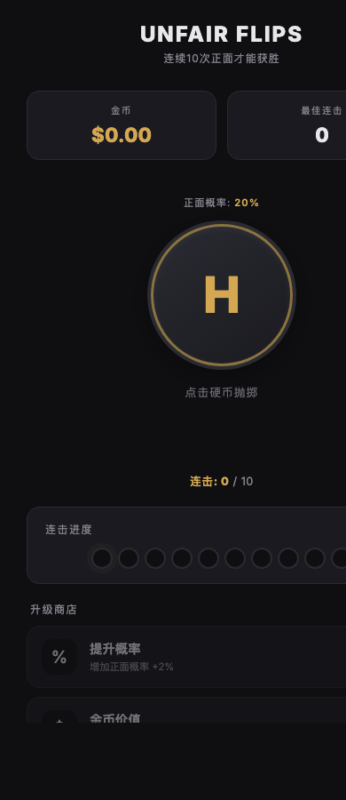
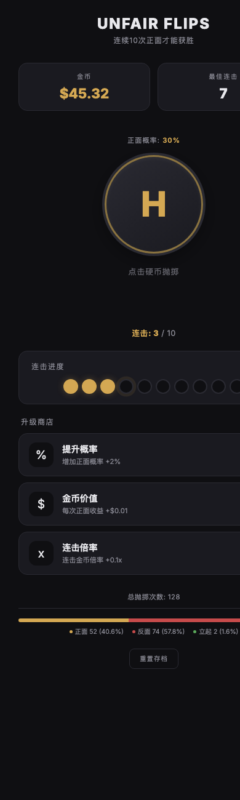
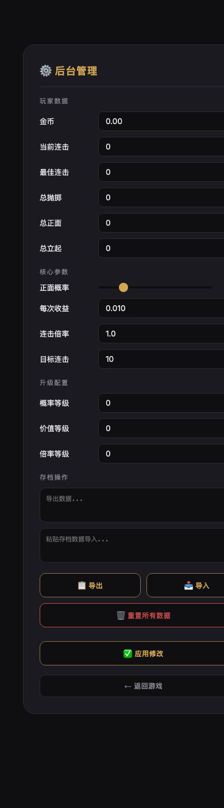

# 🪙 Unfair Flips

一款轻量化的浏览器抛硬币游戏，灵感来自 [Unfair Flips](https://store.steampowered.com/app/3925760/Unfair_Flips/)。目标只有一个：**连续抛出 10 次正面**。但你起始只有 **20%** 的正面概率——这是一场不公平的较量。

> **单文件 HTML，无需任何依赖，打开即玩。**

---

## 🎮 在线试玩

直接用浏览器打开 `index.html` 即可开始游戏。

```bash
# 方式一：直接打开
open index.html

# 方式二：启动本地服务器
python3 -m http.server 8765
# 访问 http://localhost:8765
```

---

## ✨ 特性

| 特性 | 说明 |
|------|------|
| **🎯 核心玩法** | 抛硬币，连续 10 次正面即可获胜 |
| **💰 经济系统** | 每次正面获得金币，可购买升级 |
| **📈 三大升级** | 提升概率 / 金币价值 / 连击倍率 |
| **🪙 硬币立起** | 每次抛掷有 **0.5%** 极小概率硬币立起，连击重置 |
| **📊 概率分布** | 底部实时显示 Heads / Tails / Edge 次数与百分比 |
| **💾 自动存档** | 所有进度保存在 `localStorage`，刷新不丢失 |
| **📱 移动端适配** | 完美支持手机浏览器，大触控区域 |
| **⌨️ 键盘支持** | 桌面端按 `Space` / `Enter` 抛硬币 |
| **🔒 隐藏后台** | 密码保护的管理界面，可修改任意参数 |

---

## 🖼️ 截图

### 游戏界面



### 概率分布统计



### 后台管理面板



---

## 🔐 隐藏后台管理

游戏内置了带密码保护的后台管理界面：

**触发方式**：连续快速点击标题 **"UNFAIR FLIPS"** 5 次  
**密码**：`unfair`

后台功能：
- 修改金币、连击、抛掷次数等玩家数据
- 调整正面概率、收益、倍率等核心参数
- 修改升级等级
- 导出 / 导入 JSON 存档
- 重置所有数据

---

## 🛠 技术栈

- **纯前端**：HTML + CSS + JavaScript，无框架
- **单文件**：`index.html` 即全部，无需构建
- **3D 硬币动画**：CSS `transform-style: preserve-3d` + 精确计算的 4 组关键帧
- **存档持久化**：`localStorage`

---

## 📄 License

MIT
